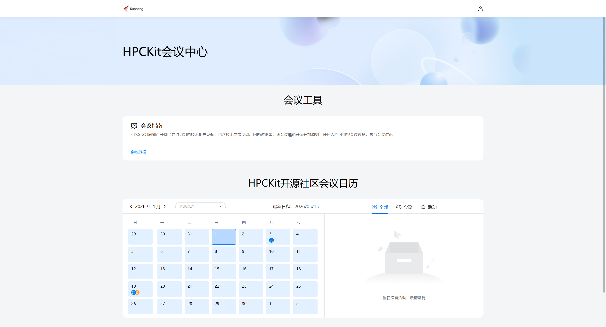
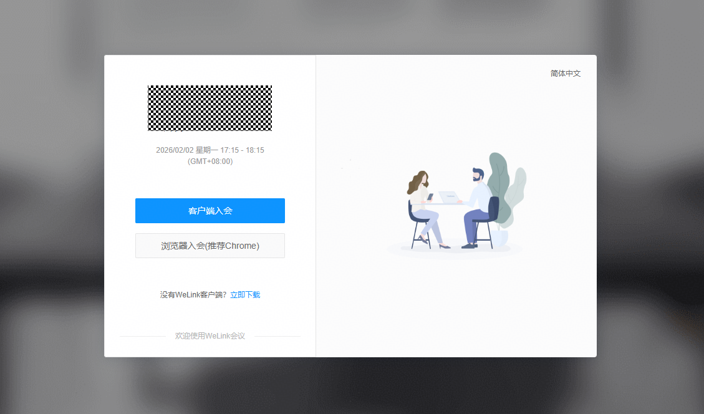
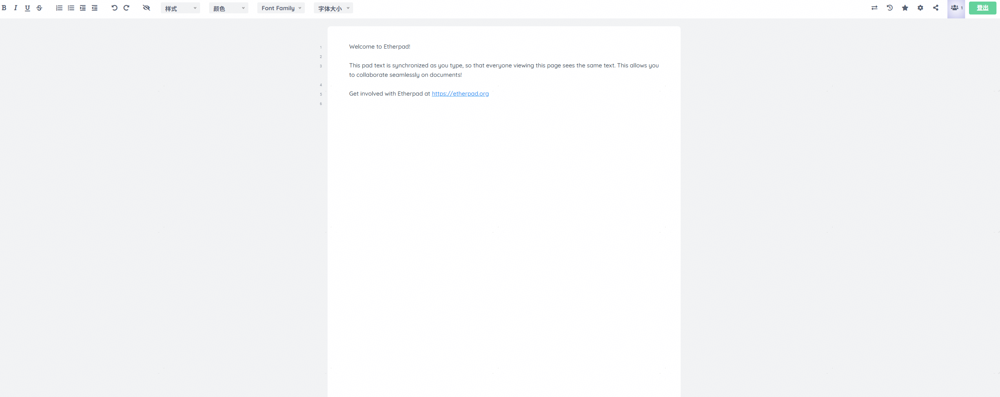
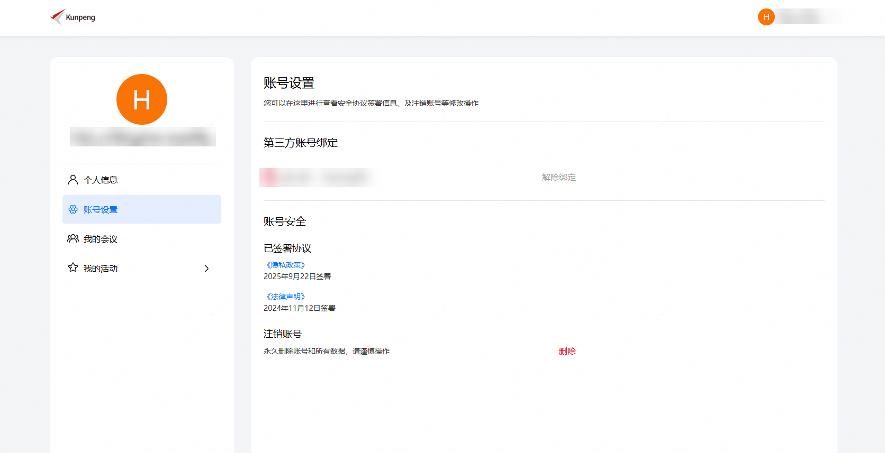
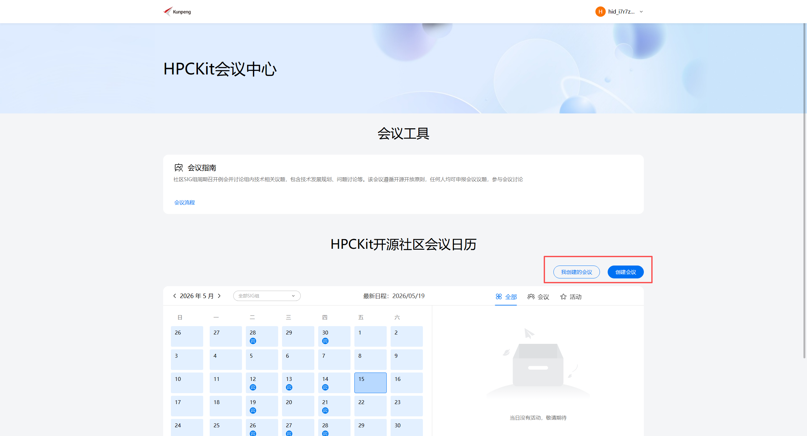
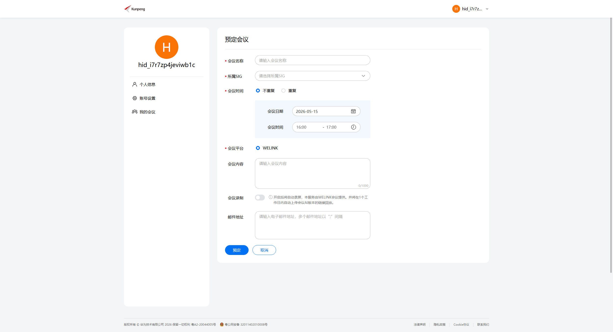
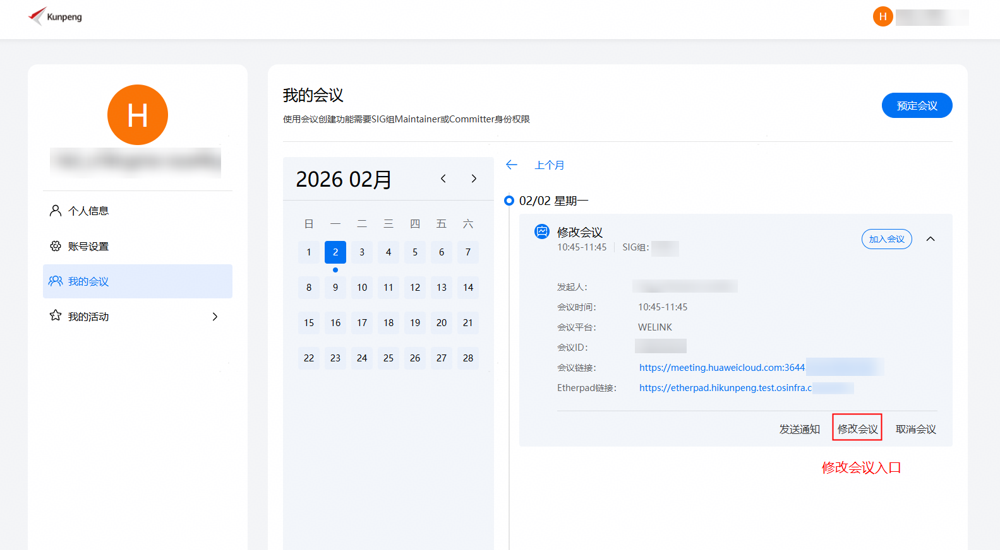
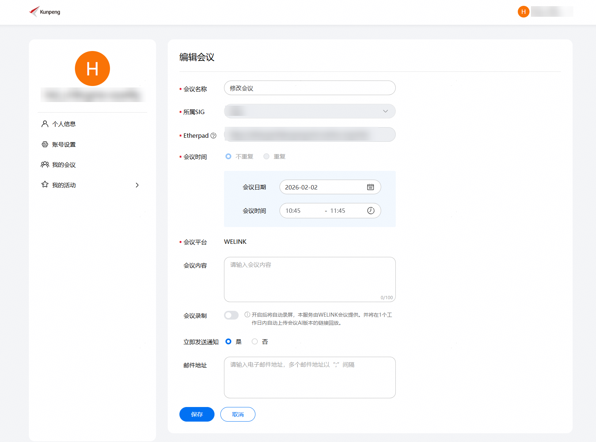
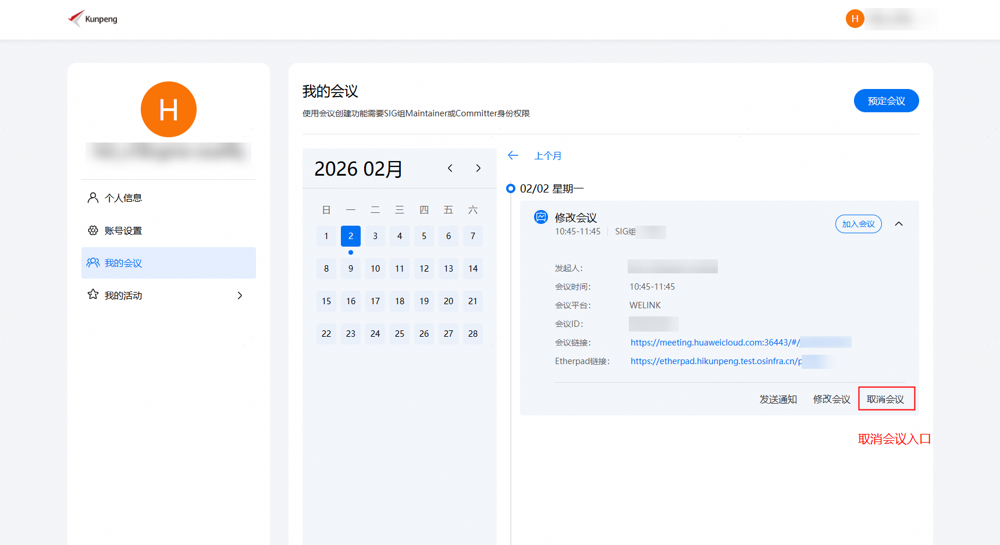

# HPCKit社区会议指南

## 1. 介绍

HPCKit社区在[社区会议平台](https://meeting.hpckit.osinfra.cn) 提供参与会议、会议预定功能。

## 2. 如何参与会议

### 2.1 浏览会议日历

您可以浏览会议日历，选择感兴趣的参与。

### 2.2 加入会议

> 在接入之前需要注册华为账号，并登录会议系统。

当会议创建后，并进入会议开始时间，我该通过什么方式参加会议？

1. 在日历中选中会议
2. 点击会议连接
3. 选择浏览器入会或者客户端入会（当前截图演示浏览器入会）

进会后请修改你的个人信息，注意不要泄露较敏感个人信息，例如工号。

你可以使用在线会议文档记录会议纪要

## 3. 如何组织会议

### 3.1 定会申请权限

HPCKit社区SIG maintainer、committer拥有创建会议权限，您需要登录社区会议平台的个人中心将gitcode账号与华为账号绑定，绑定之后您就可以预定会议。

- 注意：权限每隔1小时刷新一次，配置后请耐心等待

当您拥有定会权限时，界面如下图所示：

### 3.2 创建会议

填写会议内容：

- 会议名称： 这场会议的主题
- 所属SIG组：选择所需要开会议的SIG组
- 会议时间：选择对应的会议时间，会议时间包含单次会议与周期会议
- 会议平台：社区的会议能力由第三方提供的，目前只支持WeLink会议（蓝版）
- WeLink会议：详细内容见：https://www.huaweicloud.com/product/welink-download.html
- 会议内容：请输入会议的议题或者大概内容，详细的议题内容后续可以在etherpad里面填写。
- 会议录制：开启此选项，会议会自动录制，会议结束后会自动保存在第三方会议平台中，一天之内会议回访会被同步上传至官网，在官网中显示已开启录制的视频与语音转文字结果。
- 邮件地址：填写需要通知参加会议的核心人员和邮件列表，以“；”间隔。发送成功后可以在对应的邮件列表归档中查看此通知邮件，如果没有则存储拦截情况，请联系基础设施 [chenglang11@huawei.com](mailto:chenglang11@huawei.com)处理；如果联系不上，请联系infrastructure SIG maintainer或者在kunpengcompute/infra仓提交issue。

创建的会议会在会议平台上进行公开。

### 3.3 修改会议

如果您的会议时间需要调整，您可以进行修改会议，请根据下面步骤进行操作：

1. 点击【我创建的会议】

2. 点击【修改会议】

- 注意：修改会议暂不支持修改邮件地址，修改会议后会通知邮件列表的用户

### 3.4 取消会议

如果你的会议时间需要取消_，你可以进行取消会议，请根据下面步骤进行操作：

- 限制：在会议过期或者在半个小时之内即将开始的会议，比如昨天的会议会无法删除；比如半个小时之内即将开始的会议无法删除，这是系统默认半个小时为会议准备时间，大家都准备参加会议，此时取消会议，会对用户造成一定的影响。

1. 点击【我创建的会议】
2. 点击【取消会议】并在弹窗中【确认取消】

### 3.5 会议回放

在创建会议时可以勾选会议录制，勾选后会议内容会被录制并上传至平台。 用户可以在官网日历处查看智能回放的内容。

会议结束后一天内，会议视频会被处理并上传，可以在会议日历中查看回放链接。

## 4. FAQ

（1）创建会议的时候显示“会议时间冲突，请调整会议时间”？

> A: 这是因为会议时间已经存在会议，以你创建会议的起始和结束时间的半个小时内无会议来判断，如果您遇到该提示，请尝试更换一个会议时间，如果一直出现该提示，请联系 [@ZeesangPie](https://gitcode.com/ZeesangPie) | [chenglang11@huawei.com](mailto:chenglang11@huawei.com) 处理；如果联系不上，请联系infrastructure SIG maintainer或者在kunpengcompute/infra仓提交issue。

（2）WeLink会议出现“云会议室资源正在召开另外一场会议”？

> A: 可能是因为上一场的会议没有结束，或有人没有退出导致，请稍等再重试一下，如果长时间出现该提示，请联系 [@ZeesangPie](https://gitcode.com/ZeesangPie) | [chenglang11@huawei.com](mailto:chenglang11@huawei.com) 进行处理。如果联系不上，请联系infrastructure SIG maintainer或者在kunpengcompute/infra仓提交issue。

（3）如何主动关闭会议？

> A: 会议无法主动关闭，当所有参会人员离开会议后，会议会自动关闭。

（4）手机端如何参与会议？

> A: 手机端下载蓝版Welink APP，登录之后输入会议号即可参会。

（5）会议实际时长超过会议预定时长

> A: 会议会自动延长15分钟，超过15分钟后会议会自动结束，请合理安排会议时间。